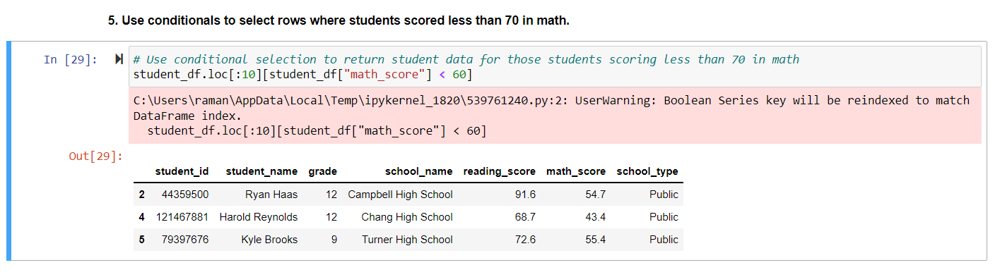

# School_District_Analysis
schools project for maria

##**Summary**

This school_budget project plays an important role towards learning new skills with Pandas,we face some challanges too, but that challanges tought us so many things.

so,what I learn through this project is how the small detailing works and gave us the output we want, think beyond the cloud is more important when we create a quaries for gathering our output,some little and silly mistake can totally effected on our output so always work with focuse is the goal.

**DISCOVERIES**

I found that if the DataFrame is not Mention correctly that cause a big problem for the whole code because that is the keyfeature here,as well as importing right function and library is one of the most important thing.

**1st important Analysis as per my thought**
As we can perform conditional and display the students name based on the grade whoes grade is greater than 70 or less than 60 or whatever it is we can also perform this conditional with display the data Row vise so if we can combine that both conditional togather with iloc than we can able to display conditional data on perticular row.

**Image:**

**In this image we can see the student information who got less than 60% grade in the first 10 rows.**
